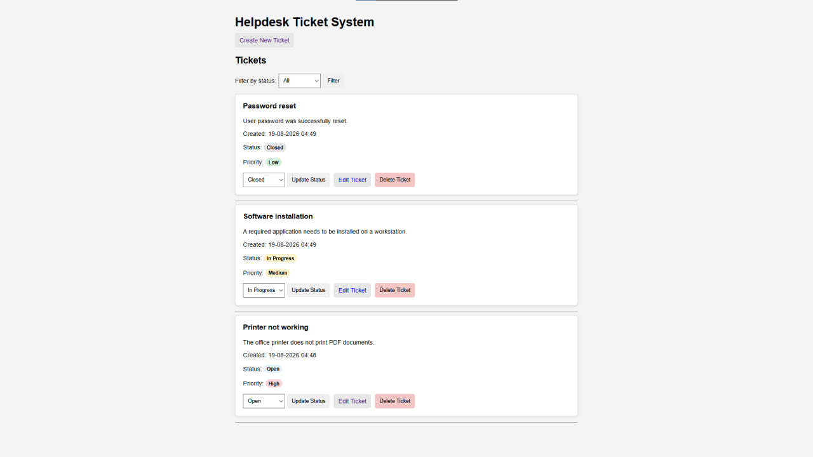

# Helpdesk Ticket System

A small web-based helpdesk application built with Python, Flask, and SQLite.

The application allows users to create and manage support tickets through a browser. I created this project to practice the basics of web development, backend logic, databases, HTML templates, and CRUD operations.

## Screenshot



## Features

* Create new support tickets
* Add a title and description
* Assign a priority:

  * Low
  * Medium
  * High
* Automatically save the ticket creation date and time
* View all tickets
* Edit ticket title, description, and priority
* Change ticket status:

  * Open
  * In Progress
  * Closed
* Filter tickets by status
* Delete tickets
* Validate empty title and description fields
* Validate allowed status and priority values on the server
* Handle requests for tickets that do not exist
* Store ticket data in an SQLite database

## Technologies

* Python
* Flask
* SQLite
* HTML
* CSS
* Jinja templates

## What I Learned

While building this project, I practiced:

* creating a web application with Flask
* creating routes for different pages and actions
* working with GET and POST requests
* receiving data from HTML forms
* using Jinja templates to display Python data in HTML
* connecting a Flask application to SQLite
* implementing CRUD operations:

  * Create
  * Read
  * Update
  * Delete
* writing parameterized SQL queries
* validating user input on the server
* working with URL parameters and ticket IDs
* filtering database results
* handling HTTP error responses such as `400` and `404`
* organizing HTML templates and static CSS files
* separating backend logic from the user interface

## Project Structure

```text
helpdesk_app/
│
├── app.py
├── requirements.txt
│
├── templates/
│   ├── index.html
│   ├── create_ticket.html
│   └── edit_ticket.html
│
└── static/
    └── style.css
```

The `tickets.db` SQLite database is created automatically when the application starts and is not included in the repository.

## Setup

1. Make sure Python is installed.

2. Open a terminal in the `helpdesk_app` folder.

3. Install the required dependency:

```bash
pip install -r requirements.txt
```

4. Start the application:

```bash
python app.py
```

On Windows, you can also use:

```bash
py app.py
```

5. Open the local address shown in the terminal, normally:

```text
http://127.0.0.1:5000
```

## Ticket Data

Each ticket contains:

* a unique ID
* title
* description
* status
* priority
* creation date and time

Ticket data is stored locally in SQLite.

## Statuses

The application supports three ticket statuses:

* `Open`
* `In Progress`
* `Closed`

Tickets can also be filtered by these statuses on the main page.

## Priorities

Each ticket can have one of three priorities:

* `Low`
* `Medium`
* `High`

The priority can be selected when creating a ticket and changed later through the edit page.

## Database

The application uses SQLite for local data storage.

The database file `tickets.db` is automatically created when the application is started for the first time. It is excluded from Git so that local test data is not uploaded to the repository.
